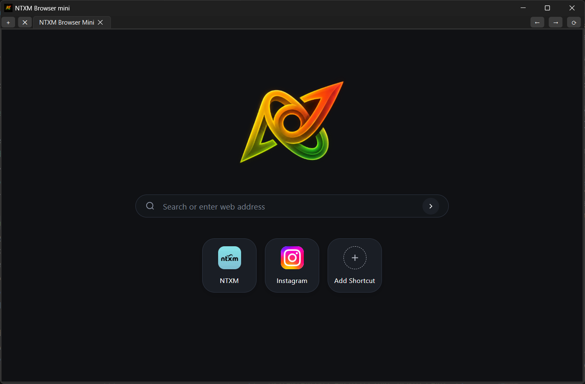
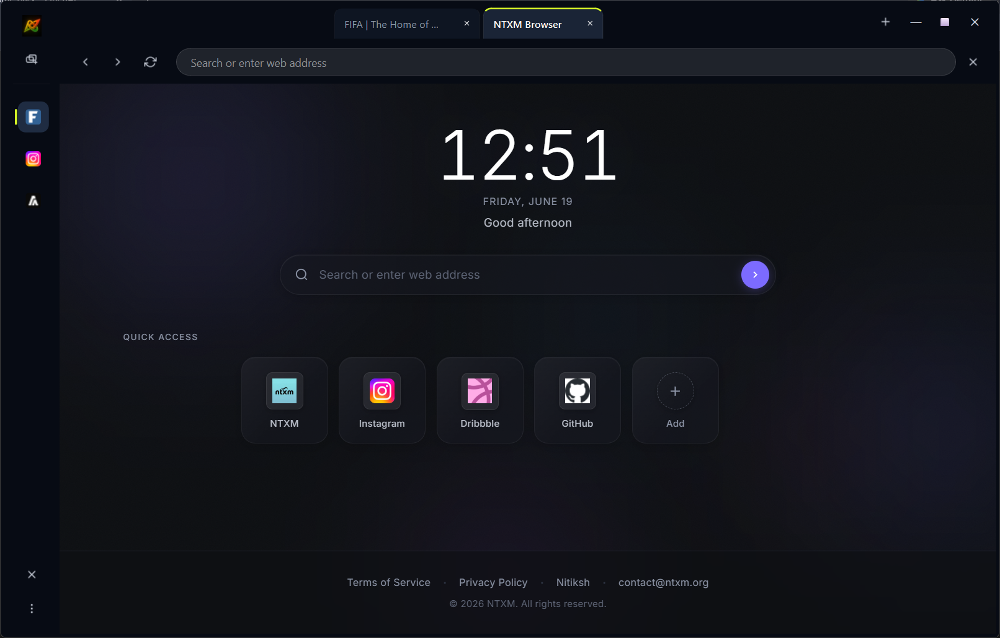
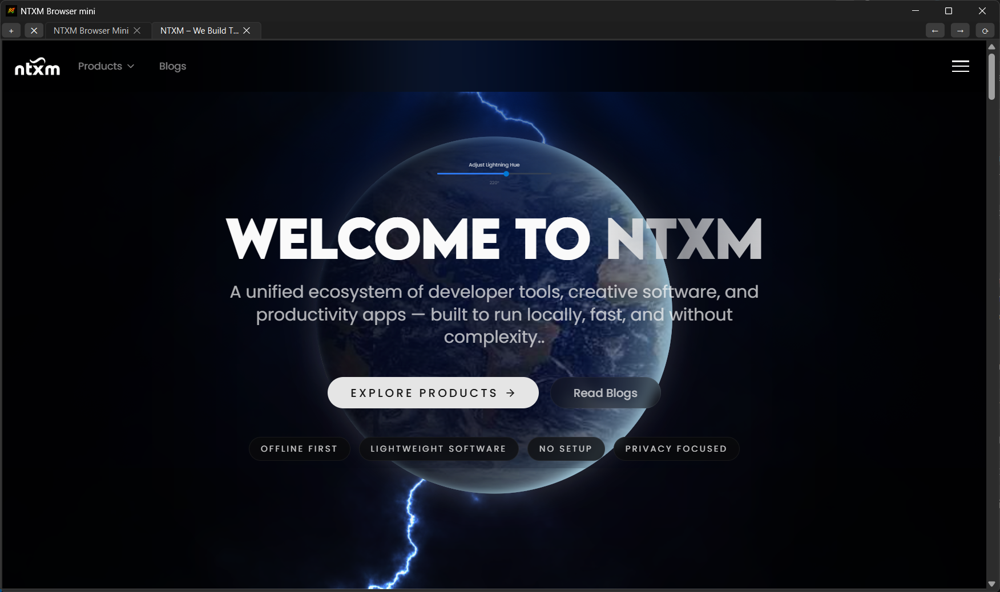
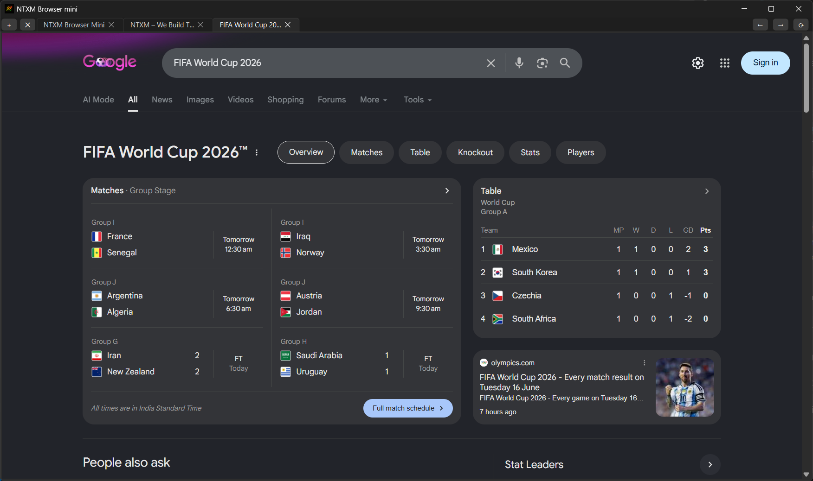

<p align="center">
  
</p>

<h1 align="center">NTXM Browser Mini</h1>

<p align="center">
  <strong>A programmable, C++ desktop browser built with Qt 6 and Chromium Embedded Framework (CEF), featuring an embedded REST Automation Server.</strong>
</p>

<p align="center">
  <a href="https://github.com/techxcelerate/browser-mini/releases/"></a>
  
</p>

---

## 🚀 Overview

NTXM Browser Mini is a lightweight, privacy-first desktop web browser designed from the ground up for developers, QA testers, and AI agents. Unlike standard consumer browsers that require bulky drivers and heavy headful processes to orchestrate, NTXM Browser Mini runs a native, multi-threaded **REST Automation Server** (`http://127.0.0.1:9090`) out-of-the-box. 

This enables you to control tabs, trigger navigation, and scrape fully rendered DOM contents programmatically using simple, lightweight HTTP requests from any language.

<p align="center">
  
</p>
<p align="center"><em>v0.1.0</em></p>

<p align="center">
  
</p>
<p align="center"><em>v0.1.1</em></p>

---

## ✨ Key Features

*   **Chromium Engine (CEF)**: Delivers rendering compliance, security, and performance utilizing Chromium Embedded Framework.
*   **Qt 6 Interface Shell**: Built with native C++ Qt 6 for responsive, low-overhead window and tab management.
*   **Embedded REST Server**: Background thread listening on port `9090` (powered by `cpp-httplib`), bypassing heavy drivers like WebDrivers.
*   **Multi-Tab Architecture**: Open, close, switch, and inspect multiple tabs programmatically.
*   **Wait-for-Load Rendering**: Synchronous navigation endpoint (`/navigate_content`) that blocks responses until client-side JS finishes rendering, resolving SPA scraping issues.
*   **Telemetry-Free & Local**: Zero remote analytics, zero background cloud sync, and fully local offline execution.

---

## 📦 Releases

You can download the latest precompiled binaries and installers for NTXM Browser Mini directly from the [GitHub Releases](https://github.com/techxcelerate/browser-mini/releases/) page.

---

## 📸 Interface Preview

<p align="center">
  
  
</p>

---

## 📡 REST Automation API Quick Reference (v0.1.0)

The local server exposes endpoints on `http://127.0.0.1:9090`. All endpoints targeting page/tab contents support optional query parameters `id` (unique lifetime ID) or `index` (0-based order).

### Tab Management

#### List Open Tabs
*   `GET /tabs` — Returns list of all active tabs in JSON.
*   *Example*:
    ```bash
    curl http://127.0.0.1:9090/tabs
    ```

#### Open New Tab
*   `POST /new_tab` — Opens a new tab, optionally navigating to a URL.
*   *Example*:
    ```bash
    curl -X POST http://127.0.0.1:9090/new_tab -d "https://github.com"
    ```

#### Close Tab
*   `POST /close_tab` — Closes target tab by index or ID.
*   *Example*:
    ```bash
    curl -X POST http://127.0.0.1:9090/close_tab?index=1
    ```

#### Switch Tab
*   `POST /activate_tab` — Switches focus to targeted tab.
*   *Example*:
    ```bash
    curl -X POST http://127.0.0.1:9090/activate_tab?id=2
    ```

### Navigation & Content Scraper

#### Asynchronous Navigation
*   `POST /navigate` — Commands tab to load a URL asynchronously.
*   *Example*:
    ```bash
    curl -X POST "http://127.0.0.1:9090/navigate?id=1" -d "https://wikipedia.org"
    ```

#### Get Current URL
*   `GET /url` — Returns active tab URL as plain text.

#### Get DOM Source HTML
*   `GET /content` — Returns raw HTML of the current DOM.
*   *Example*:
    ```bash
    curl http://127.0.0.1:9090/content?id=1
    ```

#### Synchronous Navigation (Scraper Mode)
*   `POST /navigate_content` — Loads a URL, waits for CEF load completion (or custom `delay` in ms), and returns the fully compiled HTML.
*   *Example*:
    ```bash
    curl -X POST "http://127.0.0.1:9090/navigate_content?delay=1500" -d "https://news.ycombinator.com"
    ```

---

## 📡 REST Automation API Reference (v0.1.1)

Below is the complete reference manual for the local Automation Server running inside NTXM Browser v0.1.1 (listening on port `9090`).

### 1. Parameters & Target Resolution Rules

Most endpoints accept query parameters to target specific tabs or groups:
*   **Tab targeting**:
    *   `id` (integer): The unique lifetime identifier of a tab. If provided, the tab is resolved globally.
    *   `index` (integer): The 0-based position/index of the tab.
    *   *Fallbacks*: If `id` is specified, it targets that tab globally. If `index` is specified, it targets the tab at that index in the resolved group. Otherwise, it defaults to the active tab in the resolved group.
*   **Group targeting**:
    *   `group_id` (integer): The unique lifetime identifier of a tab group.
    *   `group_index` (integer): The 0-based position of the tab group in the sidebar.
    *   *Fallbacks*: If `group_id` is specified, it targets that group. If `group_index` is specified, it targets the group at that index. Otherwise, it defaults to the active group.

### 2. Tab Group Endpoints (v0.1.1)

#### List Tab Groups
*   `GET /groups` — Retrieve a list of all currently open tab groups in the browser sidebar.
*   *Example*: `curl http://127.0.0.1:9090/groups`

#### Get Tab Group Details
*   `GET /group` — Get detailed metadata about a specific tab group.
*   *Example*: `curl "http://127.0.0.1:9090/group?group_id=1"`

#### Create New Group
*   `POST /new_group` — Create a new tab group (spawns with a homepage tab).
*   *Example*: `curl -X POST "http://127.0.0.1:9090/new_group?name=Dev&icon=:/icons/work.svg"`

#### Close Tab Group
*   `POST /close_group` — Close a tab group and delete all its tabs.
*   *Example*: `curl -X POST "http://127.0.0.1:9090/close_group?group_id=2"`

#### Switch/Activate Group
*   `POST /activate_group` — Switch focus/activation to a tab group.
*   *Example*: `curl -X POST "http://127.0.0.1:9090/activate_group?group_index=0"`

#### Rename Group
*   `POST /rename_group` — Rename a tab group.
*   *Example*: `curl -X POST "http://127.0.0.1:9090/rename_group?group_id=1" -d "Social Media"`

#### Reorder Group
*   `POST /reorder_group` — Change a group's position in the sidebar.
*   *Example*: `curl -X POST "http://127.0.0.1:9090/reorder_group?group_id=1&target_index=1"`

#### Close All Groups
*   `POST /close_all_groups` — Close all tab groups and reset to a single default group.
*   *Example*: `curl -X POST http://127.0.0.1:9090/close_all_groups`

### 3. Tab Endpoints (v0.1.1)

#### List Tabs
*   `GET /tabs` — Get a list of tabs (optionally filtered by `group_id` / `group_index`).
*   *Example*: `curl http://127.0.0.1:9090/tabs`

#### Get Tab Details
*   `GET /tab` — Get details about a specific tab.
*   *Example*: `curl "http://127.0.0.1:9090/tab?id=1"`

#### Open New Tab
*   `POST /new_tab` — Open a new tab inside a group.
*   *Example*: `curl -X POST "http://127.0.0.1:9090/new_tab?group_id=1" -d "https://github.com"`

#### Close Tab
*   `POST /close_tab` — Close a targeted tab.
*   *Example*: `curl -X POST "http://127.0.0.1:9090/close_tab?id=2"`

#### Activate/Focus Tab
*   `POST /activate_tab` — Focus/activate a tab.
*   *Example*: `curl -X POST "http://127.0.0.1:9090/activate_tab?index=0&group_id=1"`

#### Reorder/Transfer Tab
*   `POST /reorder_tab` — Move a tab's position, optionally transferring it to another group.
*   *Example*: `curl -X POST "http://127.0.0.1:9090/reorder_tab?id=2&target_index=0&target_group_id=2"`

#### Close All Tabs
*   `POST /close_all_tabs` — Close all tabs inside a group.
*   *Example*: `curl -X POST "http://127.0.0.1:9090/close_all_tabs?group_id=1"`

### 4. Navigation & Content Endpoints (v0.1.1)

#### Asynchronous Navigation
*   `POST /navigate` — Navigate a tab to a URL asynchronously.
*   *Example*: `curl -X POST "http://127.0.0.1:9090/navigate?id=1" -d "https://news.ycombinator.com"`

#### Navigation History (Back / Forward)
*   `POST /back` / `POST /forward` — Navigate back or forward in history.
*   *Example*: `curl -X POST "http://127.0.0.1:9090/back?id=1"`

#### Reload Tab
*   `POST /reload` — Reload targeted tab.
*   *Example*: `curl -X POST "http://127.0.0.1:9090/reload?id=1"`

#### Get Current URL
*   `GET /url` — Retrieve the current URL loaded in a tab.
*   *Example*: `curl http://127.0.0.1:9090/url?id=1`

#### Get Page Source HTML
*   `GET /content` — Retrieve raw HTML page source of a tab.
*   *Example*: `curl http://127.0.0.1:9090/content?id=1`

#### Synchronous Navigation (Scraper Mode)
*   `POST /navigate_content` — Navigate to a URL and wait for page to load before returning HTML.
*   *Example*: `curl -X POST "http://127.0.0.1:9090/navigate_content?id=1&delay=1500" -d "https://github.com"`

### 5. System & Persistence Endpoints (v0.1.1)

#### Save / Load Session
*   `POST /save_session` — Trigger immediate manual save to `session.json`.
*   `POST /load_session` — Trigger manual load from `session.json`.
*   *Example*: `curl -X POST http://127.0.0.1:9090/save_session`

#### Server Status
*   `GET /status` — Health check endpoint (returns `"running"`).
*   *Example*: `curl http://127.0.0.1:9090/status`

---

## 🐍 Automation Blueprint (Python)

Orchestrating browser workflows requires zero complex configurations. Below is a complete script using only Python's standard `requests` module:

```python
import requests
import time

BASE_URL = "http://127.0.0.1:9090"

# 1. Open a new tab pointing to Hacker News
new_tab = requests.post(f"{BASE_URL}/new_tab", data="https://news.ycombinator.com").json()
tab_id = new_tab.get("id")
print(f"Tab created successfully with ID: {tab_id}")

# 2. Wait for rendering and extract content
time.sleep(2)
html = requests.get(f"{BASE_URL}/content?id={tab_id}").text

# 3. Print parsed headlines
for line in html.split("\n"):
    if 'class="titleline"' in line:
        headline = line.split('">')[2].split('</a>')[0]
        print(f" Headline: {headline}")

# 4. Close the automation tab
requests.post(f"{BASE_URL}/close_tab?id={tab_id}")
print("Automation completed and tab closed.")
```

---

## 📄 License & Terms of Use

NTXM Browser Mini is proprietary software. All rights reserved. 

*   **No Source Code**: This repository does not distribute source code. It is used solely for hosting compiled application releases, installer distribution, and issue tracking.
*   **Restrictions**: You are strictly prohibited from decompiling, reverse engineering, disassembling, or attempting to derive the source code of the binary files.
*   **Usage**: The software is provided as-is for personal and professional automation, testing, and browsing workflows. Modifying, repackaging, or redistributing the binary executables without explicit written authorization is strictly prohibited.
